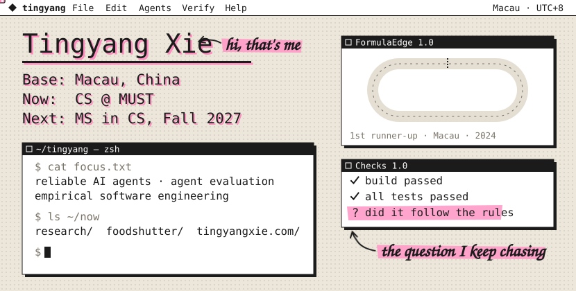
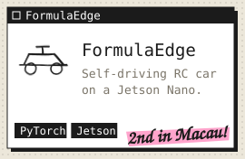
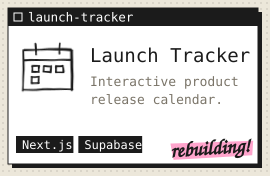
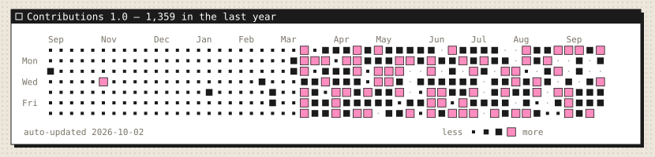
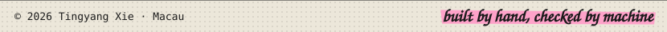

I got into computer science because right and wrong were decidable. Now I work on AI agents, where they often aren't: I build the tooling teams use to ship agents, and I study how to verify what those agents actually do.

CS undergrad at Macau University of Science and Technology · Next: MS in CS, Fall 2027

### Now

- Researching how to verify AI coding agents
- Shipping [FoodShutter](https://github.com/FoodShutter-Development-Team/FoodShutter) to the App Store
- Rebuilding tingyangxie.com

### Selected work

<a href="https://github.com/FoodShutter-Development-Team/FoodShutter"></a> <a href="https://github.com/tingyangxie/FormulaEdge-Macau-2024"></a> <a href="https://github.com/tingyangxie/launch-tracker"></a>

### Experience

```text
2026  AutoCore Technology   AI agent development intern
2026  Macao Water Supply    Software development intern · on-prem LLM apps
2025  DHgate                Software engineering intern · vision & RAG
```

### Honors

- 1st runner-up, FormulaEdge Autonomous Vehicle Competition, Macau · 2024
- 4th place finalist, China Mobile (HK) Wutong Cup Hackathon · 2024
- Dean's Honour List, 2023–24 and 2024–25 · Bank of China (Macau) Scholarship, 2024–25

### Activity



Reach me at [tingyang.xie.cs@gmail.com](mailto:tingyang.xie.cs@gmail.com)


